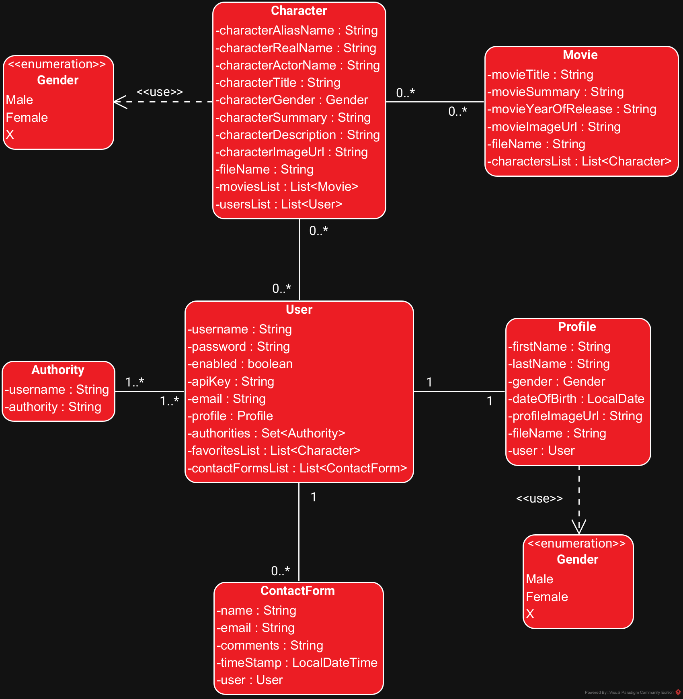

Datum laatste update: 5-2-2024

<a target="_blank" href="https://github.com/Aphelion-im/FOUNDFAVE-backend-eindopdracht-java">Github Repository FOUNDFAVE API</a>

# FOUNDFAVE API - Eindopdracht Backend NOVI Hogeschool - Quick Start

## Inhoud

- [FOUNDFAVE API Klassendiagram](#foundfave-api-klassendiagram)
- [Uitgebreide Installatiehandleiding](#uitgebreide-installatiehandleiding)
- [Benodigdheden](#benodigdheden)
- [Postman Collectie JSON Bestand](#postman-collectie-json-bestand)
- [Opstarten Webserver en Database](#opstarten-webserver-en-database)
- [FOUNDFAVE API Online Documentatie](#foundfave-api-online-documentatie)
- [Live demo React FOUNDFAVE App](#live-demo-react-foundfave-app)
- [Contact](#contact)

## FOUNDFAVE API Klassendiagram

## Uitgebreide Installatiehandleiding
De uitgebreide installatiehandleiding (PDF)(Nederlandstalig) kun je hier downloaden:

[Installatiehandleiding FOUNDFAVE API](./assets/documentation/Eindopdracht-Installatiehandleiding-v1.0.0.pdf)

## Benodigdheden

De volgende software heb je nodig om de FOUNDFAVE API te kunnen runnen:

* [IntelliJ IDEA](https://www.jetbrains.com/idea/download/) of een andere vergelijkbare editor of IDE.
* [PostgreSQL](https://www.postgresql.org/download/)
* [pgAdmin](https://www.postgresql.org/download/)
* [Postman](https://www.postman.com)

## Postman Collectie JSON-Bestand
Het JSON-bestand om te importeren in Postman kun je hier downloaden:

[Download Postman collectie JSON bestand](./assets/postman/FOUNDFAVE-API.postman_collection.json)

## Opstarten Webserver en Database
* De webserver draait op poort 8080.
* PostgreSQL/pgAdmin server draait op poort 5432.

__Een overzicht van alle beschikbare API endpoints__:
- Binnen Postman: `localhost:8080/info`

__Een overzicht van alle beschikbare Marvel karakters en Marvel films die je momenteel kunt opvragen__:
- Binnen Postman: `localhost:8080/queries`

__Inloggen op de FOUNDFAVE API__:
- Binnen Postman: `localhost:8080/login`

__Opvragen of de FOUNDFAVE API online is__:
- Binnen Postman: `localhost:8080/test`

## FOUNDFAVE API Online Documentatie
Nadat je de server hebt opgestart, kun je hier de API-documentatie lezen (Engelstalig):

<a target="_blank" href="http://localhost:8080/documentation/index.html">http://localhost:8080/documentation/index.html</a>

## Live demo React FOUNDFAVE App

Een live demo van de front-end van deze app is te vinden op:

<a target="_blank" href="https://foundfave.online">Live Demo FOUNDFAVE Online App</a>

## Contact

Mocht je nog vragen of opmerkingen hebben, stuur dan gerust een e-mail naar: andre.de.groot@novi-education.nl of stuur me een bericht via Teams.

Met vriendelijke groet,

André de Groot